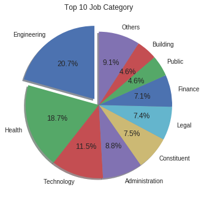
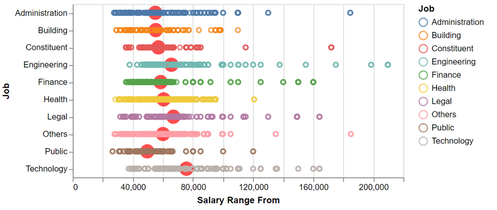
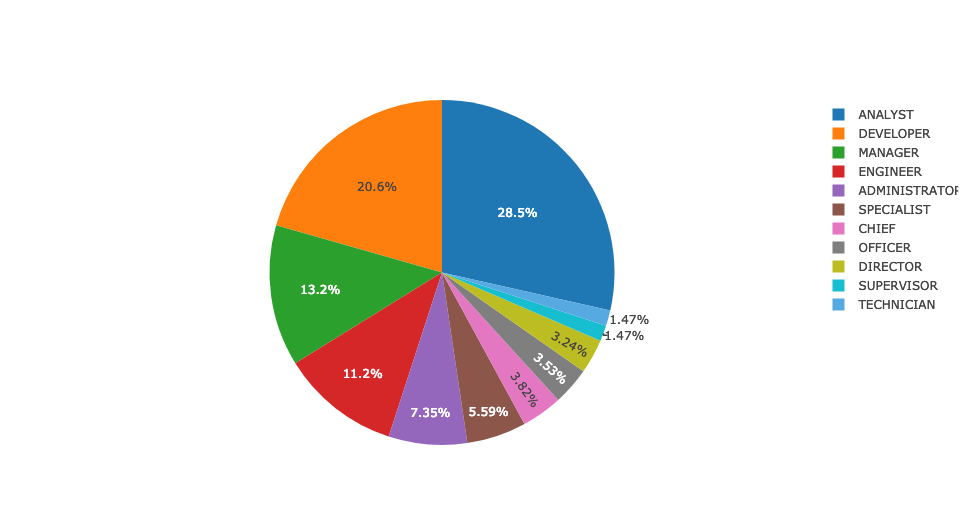

## ECE143 Project 
### Data Analysis on Software Engineering Related Jobs in New York City
----
This is a repository for ECE143 course in UCSD.  
Team members: Kuan-Wei Chen, Xiaoyin Yang, Houjian Yu and Yu Shi.

### Environment and requirement
```
import pandas as pd
import numpy as np
import matplotlib.pyplot as plt
```
```
import plotly
import plotly.plotly as py
import plotly.graph_objs as go
from plotly.offline import download_plotlyjs, init_notebook_mode, plot, iplot
init_notebook_mode(connected=True)
```
```
pip install altair
import altair as alt
alt.renderers.enable('notebook')
from altair import Chart, load_dataset
```
```
pip install geopy
from geopy.geocoders import Nominatim
```


### Part 1 Data Processing
We use the dataset [NYC_jobs](https://catalog.data.gov/dataset/nyc-jobs-26c80) from the government website.  
- First, we use 'Job category' to count the entire job category and plot a pie chart to give us an overview.  
- Then, we delete some irrelevant columns(parameters that do not have major relationship with software related jobs), e.g. 'Job ID','Posting Date','Posting Updated','Process Date', etc. Also we uppercase all information in the dataframe.  
- Then we use software related keyword search in columns 'Job Category' and 'Business Title', e.g. 'INFORMATION|SOFTWARE|DATA|NETWORK|ANALYST|IT|DEVELOPER'.  
- Now, we have 373 job positions related to software, attached with detailed information.

### Part 2 Data overview (using Altair)
We plot a pie chart using all job categories to give us a impression of whole job distribution.  
   
Also, we use Altair to plot a jobs category vs salary range plot to see each job category's salary distribution.  
    

### Part 3 Scape keyword from columns with long sentences 
Columns 'Prefered Skills' and 'Minimum Qual Requirements' have a lot of job description, also contains a lot of strings.  
Here we apply a function in each column to split each string and count the frequency of each keyword.  
We come up with some frequent keywords in both skills and requirement and plot bar chart.  

### Part 4 Title keyword search
We apply the same function to count each keyword in the column 'Business Title'. Then we have an overview of software related business title distribution.  
 

### Part 5 Geological Job and Salary Distribution (using Geopy)

### Part 6 Correlation map
